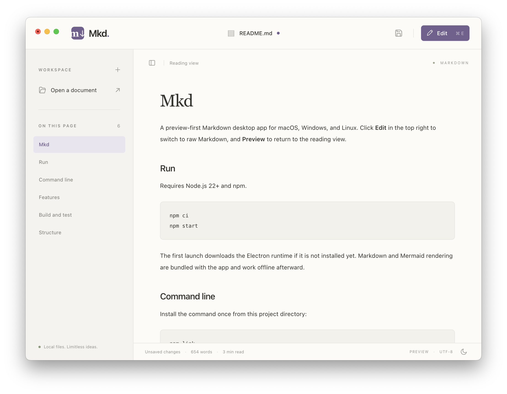
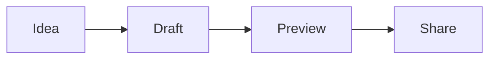

# Mkda

A preview-first Markdown desktop app for macOS, Windows, and Linux. Click **Edit** in the top right to switch to raw Markdown, and **Preview** to return to the reading view.



## Run

Requires Node.js 22+ and npm.

```sh
npm ci
npm start
```

The first launch downloads the Electron runtime if it is not installed yet. Markdown and Mermaid rendering are bundled with the app and work offline afterward.

## Command line

Install the command once from this project directory:

```sh
npm link
```

Then, from any directory:

```sh
mkd README.md
mkd "notes/my ideas.md"
mkd /absolute/path/to/document.md
mkd                         # Open the app
mkd --help
```

The command opens an existing file in preview mode, reusing the running app and preserving unsaved-change prompts. Relative paths use your terminal's current directory; quote paths containing spaces. Missing files report an error without creating anything. Use `mkd -- -notes.md` for names beginning with a dash.

The launcher prefers a packaged build in `release/`, then an installed macOS app, and falls back to the local development runtime. Run `npm run pack` to refresh a packaged build after code changes, or set `MKD_APP` to a specific app bundle or executable. Keep the project in place while the command is linked. To remove the command, run `npm unlink -g mkd`.

## Features

- Preview by default, including when opening a document.
- Raw Markdown editor with syntax highlighting, line numbers, undo/redo, search, and line wrapping.
- GitHub-flavored Markdown: tables, task lists, fenced code, and strikethrough.
- Mermaid diagrams inside fenced `mermaid` code blocks. Invalid diagrams display their source and an error without breaking the document.
- Native open, save, and save-as dialogs, with prompts before discarding unsaved changes.
- Clickable document outline, word count, reading time, and persistent light/dark themes.
- Local images resolved relative to the saved Markdown file. Web links open in the default browser; local document links can be opened using the Open dialog.
- Plain UTF-8 files, with complete temporary-file writes before replacing saved files.



| Action | macOS | Windows / Linux |
| --- | --- | --- |
| New | ⌘N | Ctrl+N |
| Open | ⌘O | Ctrl+O |
| Save | ⌘S | Ctrl+S |
| Save As | ⇧⌘S | Ctrl+Shift+S |
| Edit / Preview | ⌘E | Ctrl+E |
| Find in Markdown | ⌘F | Ctrl+F |
| Toggle outline | ⌘\\ | Ctrl+\\ |

## Build and test

```sh
npm run build  # Bundle the renderer
npm test       # Playwright tests against the actual Electron app
npm run pack  # Produce an unpacked app in release/
npm run dist  # Produce installers for the current platform
```

Tests exercise preview, editing, Mermaid, error handling, sanitization, actual file round trips, unsaved-change protection, themes, and keyboard controls. Run them in a desktop session; the test runner opens app windows. Native dialogs are stubbed in tests, while the app's real file handling is exercised.

For releases, build on each target platform (macOS: DMG/ZIP; Windows: NSIS; Linux: AppImage/DEB). Public distribution requires your own platform signing credentials; macOS notarization is not configured. This repository is ready for local development and unsigned builds.

## Structure

- `electron/main.cjs`: native window, menus, dialogs, and document/file state.
- `electron/preload.cjs`: narrow bridge between the sandboxed renderer and main process.
- `src/app.js`: editor, preview controls, outline, and theme.
- `src/render.js`: sanitized Markdown and offline Mermaid rendering.
- `src/styles.css`: reading and editing interface.

The renderer uses context isolation, sandboxing, a restrictive Content Security Policy, and no Node integration. User Markdown is sanitized with DOMPurify; Mermaid runs in strict mode. See [Electron security guidance](https://www.electronjs.org/docs/latest/tutorial/security), [Marked's sanitization guidance](https://marked.js.org/), and [Mermaid configuration](https://mermaid.js.org/config/usage.html).

Documents are kept in memory until saved; no cloud service or automatic disk save is used. Remote images still require a network connection. Windows and Linux packages should be validated on their respective operating systems before release.
